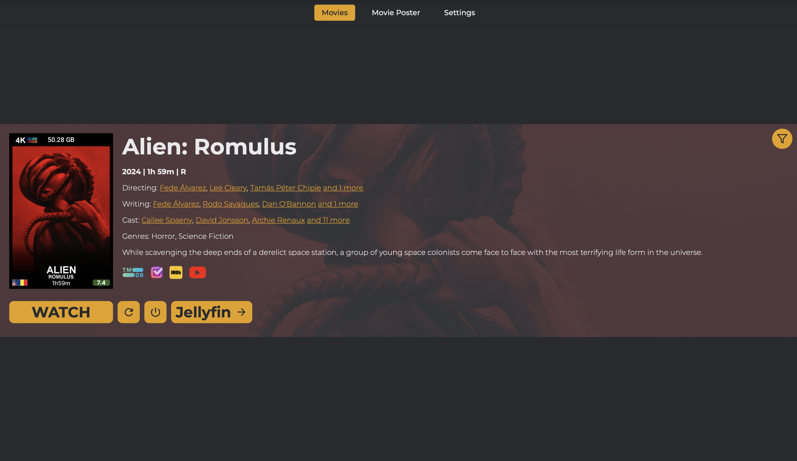

# Movie Roulette

Can't decide what to watch? Movie Roulette helps you pick random movies from your Plex and/or Jellyfin libraries, with features like cinema poster mode, service integrations, and device control.

[]()
[](https://hub.docker.com/r/sahara101/movie-roulette)
[](https://github.com/sahara101/Movie-Roulette/pkgs/container/movie-roulette)
[](https://github.com/sponsors/sahara101)
[](https://ko-fi.com/sahara101/donate)

## Main Interface
<div align="center">
  <a href=".github/screenshots/main-interface.png">
    
  </a>
</div>

## Additional Views
- [Cinema Poster Mode](.github/screenshots/poster-mode.png)
- [Homepage Widget](.github/screenshots/homepage-mode-iframe.png)
- [PWA on Mobile](.github/screenshots/pwa-interface-mobile.png)

## Rich Information
- [Cast & Crew Details](.github/screenshots/cast-example.png)
- [Movie Details](.github/screenshots/movie-details-example.png)
- [Filmography View](.github/screenshots/filmography-example.png)

## Contributing

This project was extended with the assistance of AI tools. The core functionality is based on [Random-Plex-Movie](https://github.com/Akasiek/Random-Plex-Movie) and has been expanded with additional features and integrations.

## Features

- 🎬 **Media Server Support**: Works with both Plex and Jellyfin
- 🎫 **Cinema Poster Mode**: Digital movie poster display with real-time progress
- 🔍 **Smart Discovery**: Filter by genre, year, and rating
- 📱 **PWA Support**: Install as app on mobile and desktop
- 🎮 **Device Control**: Power on Apple TV and LG TV devices
- 🔄 **Service Integration**: 
  - Trakt for watch status
  - Overseerr for requests
  - YouTube for trailers
 
> **Note**: Ensure your client devices and Plex server are on the same network. On the first run, a Plex cache file will be created to enhance movie loading speeds.
 
## Tested Players
### Plex
- Apple TV - with turn on function and app start
- Plex HTPC MacOS Client
- iPhone
- Plex for LGTV (WebOS) - with turn on function and app start
- Xiaomi MI TV Box S (Android)
### Jellyfin
- All cast capable devices

## Quick Start

## Container Images
- GitHub Container Registry: `ghcr.io/sahara101/movie-roulette:latest`
- Docker Hub: `sahara101/movie-roulette:latest`

```yaml
services:
  movie-roulette:
    image: #See above
    container_name: movie-roulette
    ports:
      - "4000:4000"
    volumes:
      - ./movie_roulette_data:/app/data
    restart: unless-stopped
```

Visit `http://your-server:4000` and configure your services.

> **Note**: For device control (Apple TV/LG TV), use `network_mode: host` instead of port mapping.

## First Run

1. Automatically redirects to settings if no services configured
2. Set up at least one media server (Plex/Jellyfin)
3. Wait for initial cache building
4. Optional: Configure additional services (Trakt, Overseerr)

## Key Configuration

### Media Servers

#### Plex
- Server URL
- Token (OAuth available)
- Movie Libraries (auto-scan available)

#### Jellyfin
- Server URL
- API Key
- User ID

### Integrations
- TMDb (built-in key provided)
- Trakt (built-in app or custom credentials)
- Overseerr (optional, for requests)

### Devices
- Apple TV (auto-discovery available)
- LG TV (network scanning available)

See [sample-compose.yml](sample-compose.yml) for full configuration options.

## Features in Action

1. **Standard Mode**
   - Random movie selection
   - Filter options
   - Movie details and trailers
   - Cast/crew filmographies

2. **Cinema Poster Mode**
   - Real-time playback status
   - Now Playing display
   - Custom default text
   - Multiple user monitoring

3. **Homepage Mode**
   - Minimalist widget

## Setup

### UI vs ENV Configuration

Movie Roulette offers two ways to configure the application:

1. **Settings UI** (Recommended)
   - Easy-to-use interface at `/settings`
   - Auto-discovery features
   - Real-time validation
   - Visual configuration

2. **Environment Variables**
   - Override UI settings
   - Lock settings in UI

> ⚠️ **Important**: When a setting is configured through ENV variables, it will:
> - Take precedence over UI settings
> - Show as "Set by environment variable" in UI
> - Be locked/disabled in settings interface

### Environment Variables

### Required (if using service)
| Variable | Description | Default | UI Alternative |
|----------|-------------|---------|----------------|
| `PLEX_URL` | Plex server URL | - | ✅ Settings with test |
| `PLEX_TOKEN` | Plex auth token | - | ✅ OAuth flow |
| `PLEX_MOVIE_LIBRARIES` | Movie library names | "Movies" | ✅ Library scanner |
| `JELLYFIN_URL` | Jellyfin server URL | - | ✅ Settings |
| `JELLYFIN_API_KEY` | Jellyfin API key | - | ✅ Auto setup |
| `JELLYFIN_USER_ID` | Jellyfin user ID | - | ✅ Auto setup |

### Optional Features
| Variable | Description | Default | UI Alternative |
|----------|-------------|---------|----------------|
| `HOMEPAGE_MODE` | Homepage widget mode | FALSE | ✅ Settings |
| `TMDB_API_KEY` | Custom TMDb key | Built-in key | ✅ Settings |
| `OVERSEERR_URL` | Overseerr URL | - | ✅ Settings |
| `OVERSEERR_API_KEY` | Overseerr API key | - | ✅ Settings |

### Device Control (Optional)
| Variable | Description | Default | UI Alternative |
|----------|-------------|---------|----------------|
| `APPLE_TV_ID` | Apple TV identifier | - | ✅ Auto-discovery |
| `LGTV_IP` | LG TV IP address | - | ✅ Auto-discovery |
| `LGTV_MAC` | LG TV MAC address | - | ✅ Auto-discovery |

### Cinema Poster (Optional)
| Variable | Description | Default | UI Alternative |
|----------|-------------|---------|----------------|
| `TZ` | Poster timezone | UTC | ✅ Settings |
| `DEFAULT_POSTER_TEXT` | Default text | - | ✅ Settings |
| `PLEX_POSTER_USERS` | Plex users to monitor | - | ✅ User selector |
| `JELLYFIN_POSTER_USERS` | Jellyfin users to monitor | - | ✅ User selector |

### Custom Trakt (Optional)
| Variable | Description | Default | UI Alternative |
|----------|-------------|---------|----------------|
| `TRAKT_CLIENT_ID` | Custom Trakt app ID | Built-in app | ✅ Built-in auth |
| `TRAKT_CLIENT_SECRET` | Custom Trakt secret | Built-in app | ✅ Built-in auth |
| `TRAKT_ACCESS_TOKEN` | Custom access token | - | ✅ Built-in auth |
| `TRAKT_REFRESH_TOKEN` | Custom refresh token | - | ✅ Built-in auth |

## Plex Configuration
### Plex Client

Navigate to settings and enable Advertise as Player.
###Plex Server

Go to settings → Network and activate Enable Local Network Discovery (GDM).

## Advanced Configuration

### Apple TV Setup with ENV
1. Get Apple TV ID:
   ```
   docker exec -ti movie-roulette /bin/sh
   atvremote scan
   ```

2. Note the Apple TV Identifier (format: xxxxxxxx-xxxx-xxxx-xxxx-xxxxxxxxxxxx)
3. Add to environment:
  environment:
  APPLE_TV_ID: "your-apple-tv-identifier"

4. Pair with Apple TV:
   ```
   docker exec -ti movie-roulette /bin/sh
   atvremote --id YOUR-ID --protocol companion pair
   ```
5. Enter PIN shown on Apple TV

### Homepage Integration
Add to <a href="http://gethomepage.dev" target="_blank" rel="noopener noreferrer">Homepage</a>'s services.yaml:
```
- Movie Roulette:
    - Movie Roulette:
        icon: /images/icons/movie-roulette.png
        widget:
          type: iframe
          src: "http://your-server:4000"
          classes: h-96 w-full
          referrerPolicy: same-origin
```

## Troubleshooting

### Plex
Issue: Pressing the "WATCH" button doesn’t show any client.

- Verify Advertise as Player is enabled on the Plex client and restart the app.
- Check for active clients using:
```curl -X GET "http://PLEXIP:32400/clients?X-Plex-Token=PLEXTOKEN"```
- (Apple TV) Disable and re-enable Advertise as Player, force close the app, and restart.
  
Issue: Apple TV doesn’t turn on.

- You need to re-pair the Apple TV after recreating the container.
  
Issue: Browser doesn’t load the poster or background.

- Use the FQDN (Fully Qualified Domain Name) for Plex/Jellyfin in the environment variables instead of the IP address.

## Support

If you find Movie Roulette useful, consider supporting development:

[](https://github.com/sponsors/sahara101)
[](https://ko-fi.com/sahara101/donate)
